<div align="center">

<!-- ═══════════════════  HEADER  ═══════════════════ -->

```
╔══════════════════════════════════════════════════════════════════╗
║                                                                  ║
║   ██████╗ ██╗  ██╗██╗  ██╗ █████╗ ███████╗███████╗███╗   ███╗  ║
║  ██╔═══██╗╚██╗██╔╝██║  ██║██╔══██╗╚══███╔╝██╔════╝████╗ ████║  ║
║  ██║   ██║ ╚███╔╝ ███████║███████║  ███╔╝ █████╗  ██╔████╔██║  ║
║  ██║   ██║ ██╔██╗ ██╔══██║██╔══██║ ███╔╝  ██╔══╝  ██║╚██╔╝██║  ║
║  ╚██████╔╝██╔╝ ██╗██║  ██║██║  ██║███████╗███████╗██║ ╚═╝ ██║  ║
║   ╚═════╝ ╚═╝  ╚═╝╚═╝  ╚═╝╚═╝  ╚═╝╚══════╝╚══════╝╚═╝     ╚═╝  ║
║                                                                  ║
╚══════════════════════════════════════════════════════════════════╝
```

</div>

<!-- ═══════════════════  WHOAMI  ═══════════════════ -->

<div align="center">

<h3><code>OxHazem@github ~ $ whoami</code></h3>

<table>
  <tr>
    <td valign="top"></td>
    <td valign="top"></td>
  </tr>
</table>

</div>

---

<!-- ═══════════════════  CURRENTLY WORKING ON  ═══════════════════ -->

<h3><code>OxHazem@github ~ $ cat current_status.log</code></h3>

```yaml
status      : "Open to internships & collaborations"
focus_2025  :
  - "Deep Learning research @ Zewail City"
  - "Building Computer Vision pipelines"
  - "Leveling up C# & Systems Design"
interests   : ["ML", "CV", "Backend Engineering", "Open Source"]
availability: "Available for Summer 2026 internships"
```

---

<!-- ═══════════════════  TECH STACK  ═══════════════════ -->

<h3><code>OxHazem@github ~ $ pkg list --installed</code></h3>

**Languages**


**ML / Data Science**


**Tools & Platforms**


---

<!-- ═══════════════════  CONTRIBUTION HEATMAP  ═══════════════════ -->

<h3><code>OxHazem@github ~ $ ./contributions.sh</code></h3>

<div align="center">

</div>

---

<!-- ═══════════════════  GITHUB STATS  ═══════════════════ -->

<h3><code>OxHazem@github ~ $ git log --stat --summary</code></h3>

<div align="center">

<table>
  <tr>
    <td>
      
    </td>
    <td>
      
    </td>
  </tr>
</table>


</div>

---

<!-- ═══════════════════  FEATURED PROJECTS  ═══════════════════ -->

<h3><code>OxHazem@github ~ $ ls -la ~/projects/</code></h3>

> 📌 **Pinned below** — or check my [repositories tab](https://github.com/OxHazem?tab=repositories) for the full list.

<!-- Add your featured project cards below. Replace the repo names with your actual repos. -->

<div align="center">

[](https://github.com/OxHazem/OxHazem)

<!-- 
  ↓ Add more project cards here — replace REPO_NAME with your actual repo names:

[](https://github.com/OxHazem/REPO_NAME)
-->

</div>

---

<!-- ═══════════════════  RESUMES  ═══════════════════ -->

<h3><code>OxHazem@github ~ $ ls ~/resumes/</code></h3>

> Click a link below to open or download the corresponding resume PDF.

| Track | Description | Link |
|:------|:------------|:----:|
| 🧠 **Machine Learning / Data Science** | ML engineering, model training, data pipelines | [📄 Download](./resumes/resume_ml.pdf) |
| 👁️ **Computer Vision** | CV research, image processing, deep learning | [📄 Download](./resumes/resume_cv.pdf) |
| 💻 **Software Engineering** | Backend, systems, general SWE roles | [📄 Download](./resumes/resume_swe.pdf) |
| 🌐 **General / All-rounder** | One-page overview for broad applications | [📄 Download](./resumes/resume_general.pdf) |

> **Note:** Resumes are updated periodically. Last updated: *<!-- UPDATE_DATE -->*

---

<!-- ═══════════════════  CONNECT  ═══════════════════ -->

<h3><code>OxHazem@github ~ $ cat contact.json</code></h3>

```json
{
  "LinkedIn"  : "https://www.linkedin.com/in/omar-hazem-ahmed-229a912wwwaa/",
  "GitHub"    : "https://github.com/OxHazem",
  "Email"     : "omarhazemhassan@gmail.com",
  "Location"  : "Egypt 🇪🇬"
}
```

<div align="center">

[](https://www.linkedin.com/in/omar-hazem-ahmed-229a912wwwaa/)
[](https://github.com/OxHazem)

</div>

---

<!-- ═══════════════════  FOOTER  ═══════════════════ -->

<div align="center">

```
[ EOF ]  — Built with 🖤 & too much ☕ by OxHazem
```


</div>